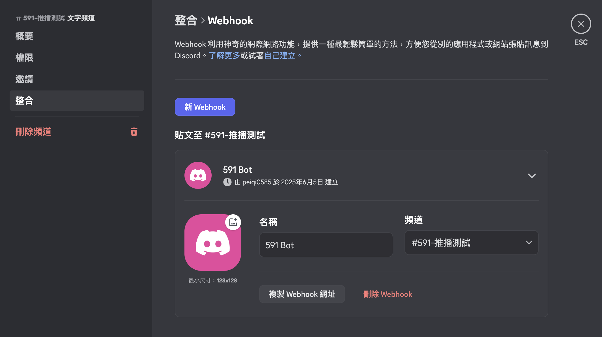
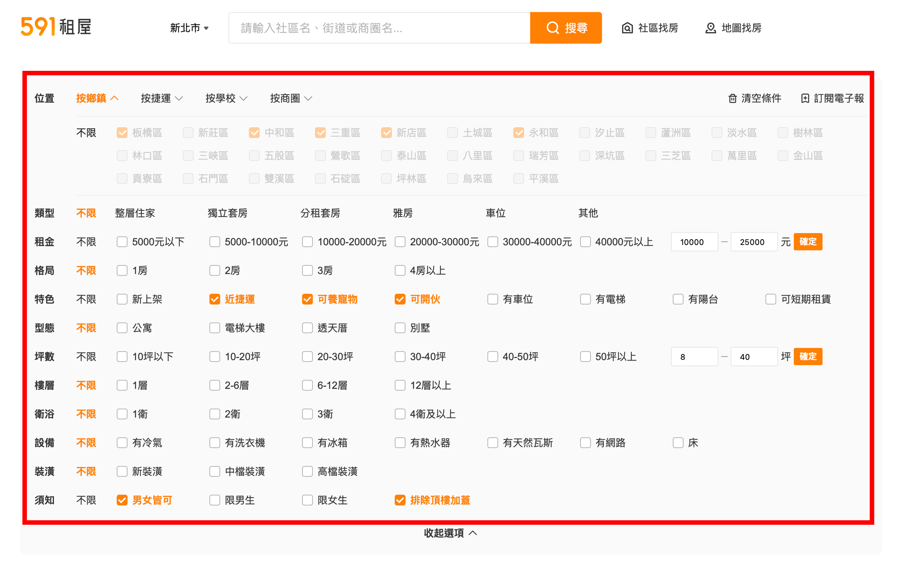
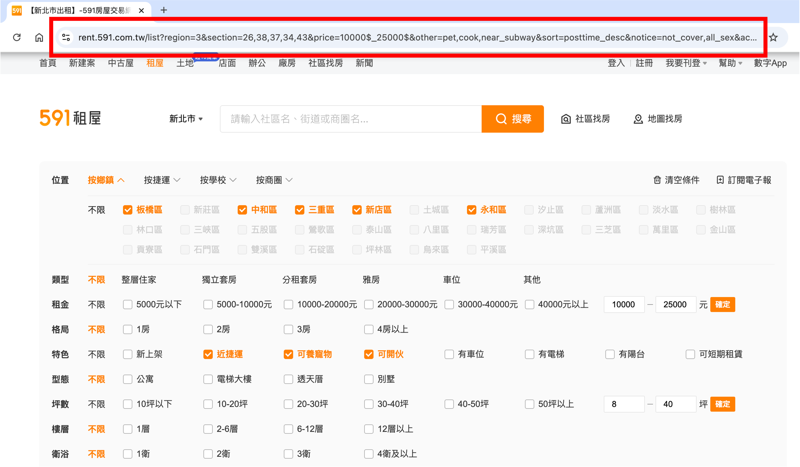
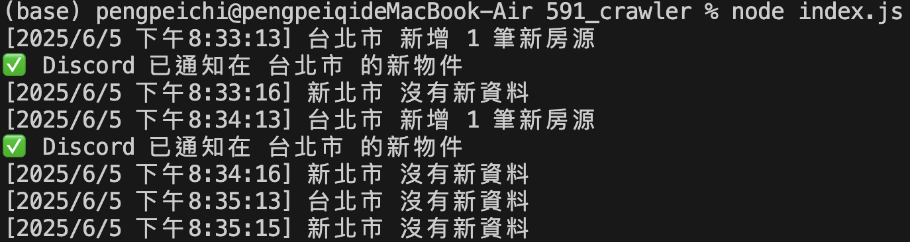

# 591 租房小幫手 - 將新上物件自動推播到 Discord 讓你租房不再慢人一步

最近開始找房子，有感好物件幾乎都是先搶先贏，於是便開始上網找有沒有可以使用的爬蟲軟體，但因為 591 租屋網一直有在防範爬蟲，所以我目前有找到的開源不是不能使用、就是使用已經終止服務的 LINE Notify，因此我便寫了這個小工具，希望能借助他，讓我順利找到房子。

這個專案是使用 Node.js，結合 Playwright 進行自動化操作，可以定期檢查有沒有新物件，並將新物件推播到 Discord，除此之外，也加進了一些過去其他專案沒有的功能，像是可以新增多個篩選條件，讓同時在台北、新北找房的我能一次掌握兩個縣市的最新物件！然而這個小工具目前有一些限制，這在下面會詳細說明。

**另外，這個小工具成功讓我在七天內找到位於租屋市場競爭的北市、租金低於行情且不錯的的房子！**


## 功能介紹

- 每次程式執行，會根據你設定的篩選條件到 591 網站上爬蟲、再進行新舊物件比對，最後將近期更新的物件（除了新物件外也包含剛更新的舊物件）推播到 Discord
- 可以設置程式執行的間隔，讓新物件通知依個人設置的頻率發送（例如半小時通知一次）
- 可以設置多個篩選條件，一次進行多縣市找房
- 若設定的通知間隔較長，可以調整新舊物件的比對數量，讓新物件不被遺漏
- 透過 Discord 的特性，讓多人可以加入同一 Discord 伺服器討論

❗ **下面是如何架設自己的 server 使用這個小工具的詳細說明** ❗

## 安裝相關套件

```bash
# 安裝必要套件
npm install

# 安裝 Playwright 需要用到的瀏覽器執行檔
npx playwright install
```

## Configuration

### 1. 取得 Discord Webhook

- **打開你的 Discord 頻道**  
  找一個你有管理權限的伺服器，並進入你想收到通知的文字頻道

- **開啟整合功能**  
   點擊頻道名稱旁邊的 ⚙️（編輯頻道）→ 點選左側選單的 **整合**

- **新增 Webhook**
  - 點選 **建立 Webhook**
  - 你可以：
    - 幫 Webhook 命名（例如：591 Bot）
    - 選擇要發送訊息的頻道
  - 然後點擊 **複製 Webhook 網址**（這就是你要填入 .env 的網址）

  

- **貼到 `.env` 中**  
   先將專案根目錄的 `.env.example` 檔案改名為 `.env`，再貼上剛複製的網址
  ```env
  DISCORD_WEBHOOK_URL=your_webhook_url_here
  ```

### 2. 設置篩選條件網址

- 去 591 租屋網設置想要獲取通知的設定  
  

- 往下滑，並設定排序為 **最新**  
   

- 複製網址  
   

- 貼到 `config.json` 中  
   打開專案根目錄的 `config.json`，貼上剛複製的網址，如果想要有多個篩選條件（例如：台北市、新北市），可以重複以上步驟，並按照下面格式貼上網址
  ```json
  "urls": [
   "your_first_url",
   "your_second_url"
  ],
  ```

### 3. 其他設定

在 `config.json` 中，有兩個參數能自行調整：

```json
  "intervalMinutes": 30,
  "fetchCount": 15
```

- intervalMinutes 為程式執行的時間間隔，預設為每 30 分鐘執行一次
- fetchCount 為每次執行程式，每個篩選條件下的所獲取的最新房源數量（包含最近更新的房源），程式的邏輯是比對上一次執行所存下的房源，篩選出沒看過的物件，並推播給使用者

最後，需將 `index.js` 內 `setInterval(checkForNewListings, intervalMs);` 的註解拿掉

## 執行

```bash
node index.js
```

你會看到終端機顯示爬蟲執行狀況，並於有新物件時推播至 Discord



此為設定一分鐘執行一次的終端機顯示結果

## 補充說明

- 由於程式的邏輯是比對上一次執行所存下的房源，篩選出沒看過的物件，因此若程式執行間隔較長，可能會有新物件被漏掉的情況，建議在設定較長的間隔時，將 `fetchCount` 設定為較大的數字
- 有可能出現推播較舊物件的情況，這是因為在上一次執行程式後，所存下的房源可能被刪除，導致程式所抓取的最新物件是更久之前已經推播過的，這是目前程式邏輯的限制
- 不建議加入太多篩選條件，在有過多的新物件需要推播時，會超出 Discord 的 rate limit，目前測試過加入兩個篩選條件，每個篩選條件都有 20 筆新物件時是可以正常運作的
